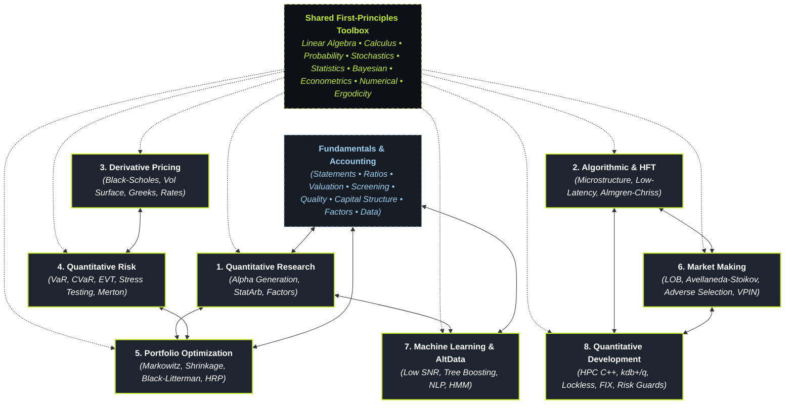

# Kwant Atlas: The First-Principles Map of Quantitative Finance

> *"From noise to insight."* — **KwantKlubben (SDU)**

Welcome to **Kwant Atlas**, the universal, interconnected knowledge base and diagnostic study tool for quantitative finance. 

Rather than a linear, week-by-week curriculum, the Atlas is structured around the **8 foundational operational disciplines of quantitative finance**. Every discipline connects directly back to first principles: mathematical ground truths, computational systems, empirical failure modes, and canonical literature.

---

## 🧭 The 8 Key Pillars of Quantitative Finance

---

### 1. [[pillars/01-quantitative-research/index|Quantitative Research (Alpha Generation)]]
Analyzing historical and alternative market data to discover predictive trading signals and statistical anomalies.
- **[[pillars/01-quantitative-research/statistical-arbitrage-and-pairs-trading|Statistical Arbitrage & Pairs Trading]]**: Cointegration, Ornstein-Uhlenbeck spread dynamics, and half-life decay.
- **[[pillars/01-quantitative-research/cross-sectional-and-time-series-momentum|Cross-Sectional & Time-Series Momentum]]**: Factor ranking, CTA trend following, volatility scaling, and momentum crashes.
- **[[pillars/01-quantitative-research/fundamental-multi-factor-models|Fundamental Multi-Factor Models]]**: Fama-French 5-factor, Barra cross-sectional style factors, and factor crowding.
- **[[pillars/01-quantitative-research/signal-processing-and-kalman-filtering|Signal Processing & Kalman Filtering]]**: Linear state-space systems, dynamic hedge ratios, and adaptive noise filtering.
- **[[pillars/01-quantitative-research/feature-engineering-and-labeling|Feature Engineering & Target Labeling]]**: Flaws of fixed-time horizons, the Triple Barrier Method, and Meta-Labeling.
- **[[pillars/01-quantitative-research/backtesting-hygiene-and-deflated-sharpe|Backtesting Hygiene & Deflated Sharpe Ratio]]**: The multiple testing problem, selection bias, and Bailey & Lopez de Prado's DSR.

---

### 2. [[pillars/02-algorithmic-hft/index|Algorithmic and High-Frequency Trading (HFT)]]
Designing automated execution systems operating across the millisecond to nanosecond frontier.
- **[[pillars/02-algorithmic-hft/market-microstructure-and-order-types|Market Microstructure & Order Types]]**: Passive vs aggressive orders, hidden icebergs, pegged orders, and maker-taker fee rebates.
- **[[pillars/02-algorithmic-hft/low-latency-systems-architecture|Low-Latency Systems Architecture]]**: Kernel bypass (Solarflare Onload, DPDK), CPU pinning, NUMA affinity, and zero-copy pipelines.
- **[[pillars/02-algorithmic-hft/queue-position-and-fill-probability|Queue Position & Fill Probability]]**: FIFO vs Pro-Rata matching engines, cancellation dynamics, and adverse selection at queue heads.
- **[[pillars/02-algorithmic-hft/execution-algorithms-vwap-twap-pov|Execution Algorithms: VWAP, TWAP, & POV]]**: Institutional order slicing, intraday volume curves, and tracking error optimization.
- **[[pillars/02-algorithmic-hft/optimal-execution-and-almgren-chriss|Optimal Execution & Almgren-Chriss]]**: Permanent vs temporary market impact, execution risk aversion, and calculus of variations trajectories.
- **[[pillars/02-algorithmic-hft/hardware-acceleration-and-fpga|Hardware Acceleration & FPGA]]**: Wire-speed packet parsing on silicon, sub-50ns tick-to-trade, and hardware safety gates.

---

### 3. [[pillars/03-derivative-pricing/index|Derivative Pricing and Structuring]]
The traditional sell-side quant domain: valuing non-linear financial contracts and engineering self-financing dynamic hedges.
- **[[pillars/03-derivative-pricing/no-arbitrage-and-binomial/index|No-Arbitrage Foundations & Binomial Trees]]**: Law of one price, put-call parity, Cox-Ross-Rubinstein discrete replication, and American early exercise.
- **[[pillars/03-derivative-pricing/black-scholes-merton/index|Black-Scholes-Merton & Feynman-Kac Bridge]]**: Delta-neutral hedging, parabolic PDE derivation, and risk-neutral conditional expectations.
- **[[pillars/03-derivative-pricing/black-scholes-merton/04-greeks-and-hedging|The Greeks & Dynamic Hedging]]**: First and higher-order Greeks (Delta, Gamma, Vega, Theta, Vanna, Volga) and the fundamental Gamma-Theta trade-off.
- **[[pillars/03-derivative-pricing/volatility-surfaces-and-smiles/index|Implied Volatility Surfaces & Smiles]]**: Numerical root finding, skew/smile dynamics, sticky rules, and Dupire local volatility.
- **[[pillars/03-derivative-pricing/advanced-volatility-heston-sabr/index|Advanced Volatility: Heston & SABR Models]]**: Stochastic variance processes, the Feller condition, and swaption smile fitting.
- **[[pillars/03-derivative-pricing/interest-rate-and-term-structure/index|Interest Rate & Term Structure Models]]**: Yield curve bootstrapping, short-rate dynamics (Vasicek, CIR), and the Hull-White framework.

---

### 4. [[pillars/04-quantitative-risk/index|Quantitative Risk Management]]
Measuring, bounding, and mitigating financial exposure to guarantee firm survival across extreme market volatility.
- **[[pillars/04-quantitative-risk/var-and-expected-shortfall|Value at Risk & Expected Shortfall (CVaR)]]**: Coherent risk measure axioms, the subadditivity flaw of VaR, and Cornish-Fisher expansions.
- **[[pillars/04-quantitative-risk/parametric-historical-and-monte-carlo-var|Parametric, Historical, & Monte Carlo VaR]]**: Variance-covariance methods, filtered historical simulation (FHS), and Kupiec backtest batteries.
- **[[pillars/04-quantitative-risk/extreme-value-theory-and-fat-tails|Extreme Value Theory & Fat Tails]]**: Breakdown of normality, Peaks-Over-Threshold (POT), Generalized Pareto Distributions (GPD), and the Hill tail index.
- **[[pillars/04-quantitative-risk/stress-testing-and-scenario-analysis|Stress Testing & Reverse Stress Testing]]**: Historical crisis replay (1987, 1998, 2008, 2020), macro factor shocks, and reverse stress testing.
- **[[pillars/04-quantitative-risk/credit-risk-and-the-merton-model|Credit Risk & the Merton Structural Model]]**: Equity as a call option on firm assets, distance-to-default, and structural default probability.
- **[[pillars/04-quantitative-risk/liquidity-risk-and-margin-spirals|Liquidity Risk & Margin Spirals]]**: Bid-ask spread hair-cuts, market depth exhaustion, and the Brunnermeier-Pedersen margin spiral.

---

### 5. [[pillars/05-portfolio-optimization/index|Portfolio Construction and Optimization]]
Applying mathematical frameworks to allocate capital across assets, maximizing risk-adjusted return under real friction.
- **[[pillars/05-portfolio-optimization/modern-portfolio-theory-and-mean-variance|Modern Portfolio Theory & Mean-Variance Frontiers]]**: Markowitz quadratic programs, the tangency portfolio, and the "estimation error maximizer" paradox.
- **[[pillars/05-portfolio-optimization/covariance-shrinkage-and-denoising|Covariance Shrinkage & RMT Denoising]]**: The curse of dimensionality ($N > T$), Ledoit-Wolf analytical shrinkage, and Marchenko-Pastur eigenvalue filtering.
- **[[pillars/05-portfolio-optimization/black-litterman-asset-allocation|Black-Litterman Bayesian Asset Allocation]]**: Reverse optimization for equilibrium implied returns, blending quant views with market priors.
- **[[pillars/05-portfolio-optimization/risk-parity-and-equal-risk-contribution|Risk Parity & Equal Risk Contribution (ERC)]]**: Marginal risk contribution, why 60/40 is 90% equity risk, and leverage in risk-balanced portfolios.
- **[[pillars/05-portfolio-optimization/hierarchical-risk-parity-and-clustering|Hierarchical Risk Parity (HRP)]]**: Correlation distance metrics, tree graph clustering, and matrix-inversion-free allocation.
- **[[pillars/05-portfolio-optimization/transaction-costs-and-turnover-constraints|Transaction Costs & Turnover Constraints]]**: Penalizing quadratic market impact, L1/L2 regularization, and sparse rebalancing frontiers.

---

### 6. [[pillars/06-market-making/index|Market Making and Liquidity Provision]]
Designing automated systems that quote continuous two-sided liquidity, profiting from the bid-ask spread while managing inventory and adverse selection.
- **[[pillars/06-market-making/limit-order-book-mechanics-and-l3|Limit Order Book Mechanics & L3 Data]]**: Level 1/2/3 data feeds, order reconstruction engines, and Order Flow Imbalance (OFI).
- **[[pillars/06-market-making/the-avellaneda-stoikov-model|The Avellaneda-Stoikov Model]]**: Hamilton-Jacobi-Bellman (HJB) formulation, reservation prices, inventory penalty, and optimal quotes.
- **[[pillars/06-market-making/adverse-selection-and-glosten-milgrom|Adverse Selection & Glosten-Milgrom]]**: Informed vs uninformed noise traders, Bayesian price updating, and Kyle's Lambda price impact.
- **[[pillars/06-market-making/spread-decomposition-and-roll-model|Spread Decomposition & the Roll Model]]**: Return autocovariance, bid-ask bounce, and separating inventory costs from adverse selection.
- **[[pillars/06-market-making/inventory-management-and-quote-skewing|Inventory Management & Quote Skewing]]**: Asymmetric quote positioning, mean-reverting inventory targets, and overnight risk.
- **[[pillars/06-market-making/toxic-order-flow-and-vpin|Toxic Order Flow & VPIN]]**: The Lee-Ready algorithm, Volume-Synchronized Probability of Toxicity (VPIN), and flash crash early warning metrics.

---

### 7. [[pillars/07-machine-learning-altdata/index|Machine Learning and Alternative Data]]
Extracting non-linear signals and structural patterns from alternative, unstructured, and high-dimensional datasets.
- **[[pillars/07-machine-learning-altdata/financial-ml-pitfalls-and-low-snr|Financial ML Pitfalls & Low SNR]]**: Why standard ML fails, the microscopic Signal-to-Noise Ratio, non-stationarity, and subtle data leakage traps.
- **[[pillars/07-machine-learning-altdata/tree-based-factor-ranking-and-purged-cv|Tree-Based Factor Ranking & Purged CV]]**: LightGBM/XGBoost factor synthesis, Mean Decrease Accuracy (MDA), and Purged/Embargoed Cross-Validation.
- **[[pillars/07-machine-learning-altdata/financial-nlp-and-earnings-transcripts|Financial NLP & Earnings Transcripts]]**: SEC 10-K delta analysis, FinBERT fine-tuning, earnings call Q&A sentiment, and LLM extraction.
- **[[pillars/07-machine-learning-altdata/alternative-data-pipelines-and-evaluation|Alternative Data Pipelines & Evaluation]]**: Credit card streams, web scraping, geolocation, point-in-time hygiene, and alpha decay.
- **[[pillars/07-machine-learning-altdata/regime-classification-hmm-and-gmm|Regime Classification: HMM & GMM]]**: Unsupervised regime detection, Baum-Welch Expectation-Maximization, and Viterbi state path decoding.
- **[[pillars/07-machine-learning-altdata/deep-learning-for-sequential-data|Deep Learning for Sequential Data]]**: LSTMs, Temporal Convolutional Networks (TCN), and Temporal Fusion Transformers for tick and bar series.

---

### 8. [[pillars/08-quantitative-development/index|Quantitative Development (Quant Engineering)]]
The software and systems engineering backbone: translating mathematical models into ultra-low-latency production infrastructure.
- **[[pillars/08-quantitative-development/high-performance-cpp-for-trading|High-Performance C++ for Trading]]**: Zero-allocation paradigms, CPU cache locality (L1/L2/L3), cacheline false sharing, and SIMD vectorization.
- **[[pillars/08-quantitative-development/tick-level-databases-and-timeseries|Tick-Level Databases & kdb+/q]]**: Column-oriented architectures, kdb+/q vector primitives, DuckDB/ClickHouse pipelines, and point-in-time as-of joins.
- **[[pillars/08-quantitative-development/event-driven-backtesting-engines|Event-Driven Backtesting Engines]]**: Vectorized vs event loops, realistic fill modeling, order state machines, and deterministic historical replay.
- **[[pillars/08-quantitative-development/fix-protocol-and-exchange-connectivity|FIX Protocol & Exchange Connectivity]]**: Tag-value FIX, session recovery, binary ITCH/OUCH protocols, and order state lifecycles.
- **[[pillars/08-quantitative-development/concurrency-and-lockless-programming|Concurrency & Lockless Programming]]**: The LMAX Disruptor pattern, SPSC ring buffers, memory fences, and atomic synchronization.
- **[[pillars/08-quantitative-development/production-risk-guards-and-kill-switches|Production Risk Guards & Kill Switches]]**: Wire-speed pre-trade risk checks, fat-finger caps, rate throttles, and automated kill switches.

---

## 🔬 First-Principles Toolbox & Foundations

Before diving into complex models, anchor your intuition in the rigorous mathematical foundations that underwrite all 8 disciplines:

* 📐 **[[foundations/linear-algebra-and-matrices/index|Linear Algebra & Matrices]]**: Vector spaces, spectral theory, positive semi-definiteness, and SVD.
* 📈 **[[foundations/calculus-and-optimization/index|Calculus & Constrained Optimization]]**: Gradients, Hessians, Taylor expansions (Greeks), and KKT conditions.
* 🎲 **[[foundations/probability-and-measure-theory/index|Probability & Measure Theory]]**: Probability spaces, filtrations, conditional expectations, and martingales.
* 🌊 **[[foundations/stochastic-calculus/index|Stochastic Calculus & Itô's Lemma]]**: Brownian motion, quadratic variation, Itô's formula, and Girsanov change of measure.
* 📊 **[[foundations/econometrics-and-timeseries/index|Econometrics & Time Series]]**: Stationarity, unit roots (ADF), cointegration, and GARCH volatility clustering.
* 📈 **[[foundations/statistics-and-inference/index|Statistics & Inference]]**: Point estimation, the Central Limit Theorem, confidence intervals, and bias–variance validation.
* 🎛️ **[[foundations/bayesian-statistics/index|Bayesian Statistics]]**: Bayes' theorem, priors, posterior inference, MCMC, and Bayesian regularization.
* 🔢 **[[foundations/numerical-methods/index|Numerical Methods]]**: Finite differences, Monte Carlo, numerical optimization, and numerical linear algebra.
* ⏳ **[[foundations/ergodicity-and-statistical-mechanics/index|Ergodicity & Statistical Mechanics]]**: Ensemble vs time averages, multiplicative growth, the Kelly criterion, and ruin theory.

---

## 📊 Fundamentals & Accounting (Cross-Cutting Area)

The company underneath every security. This area sits *alongside* the 8 pillars and the Foundations toolbox, covering how a business is reported, valued, financed, quality-checked, and sourced as data — the shared substrate for both **quantitative** factor projects and **discretionary** fundamental work.

**→ [[fundamentals-accounting/index|Open the Fundamentals & Accounting area hub]]**

The 8 topic-folders, in recommended learning order:

1. [[fundamentals-accounting/financial-statements-and-accounting/index|Financial Statements & Accounting]] — the accounting equation, double-entry, and the three statements.
2. [[fundamentals-accounting/core-financial-ratios/index|Core Financial Ratios]] — profitability, multiples, liquidity, leverage, and the ratio lookup table.
3. [[fundamentals-accounting/equity-valuation/index|Equity Valuation]] — DCF, cost of capital, multiples, comps, and the margin of safety.
4. [[fundamentals-accounting/fundamental-analysis-and-screening/index|Fundamental Analysis & Screening]] — Graham-style criteria and mechanical screen construction.
5. [[fundamentals-accounting/accounting-quality-and-red-flags/index|Accounting Quality & Red Flags]] — accruals, earnings management, and the red-flag checklist.
6. [[fundamentals-accounting/capital-structure-and-corporate-finance/index|Capital Structure & Corporate Finance]] — Modigliani–Miller, the tax shield, distress, and agency costs.
7. [[fundamentals-accounting/quantitative-fundamental-investing/index|Quantitative Fundamental Investing]] — value, profitability, investment, and accrual *factors*.
8. [[fundamentals-accounting/data-sources-and-corporate-data/index|Data Sources & Corporate Data]] — EDGAR/XBRL, vendors, and point-in-time data hygiene.

---

## 🛠️ First-Principles Diagnostic Matrix: "Why Is My Strategy Failing?"

When a quantitative strategy underperforms, drawdowns blow out, or live execution bleeds cash, use this first-principles troubleshooting matrix to isolate the mathematical or structural flaw:

| Observed Symptom in Production / Test | Underlying First-Principles Failure Mode | Diagnostic & Root Cause | Remedy Note |
| :--- | :--- | :--- | :--- |
| **Strategy shows 3.5 Sharpe in backtest, but instantly loses money live** | Backtest Overfitting & Selection Bias | Testing thousands of parameter permutations without controlling for sample length or non-normality. | [[pillars/01-quantitative-research/backtesting-hygiene-and-deflated-sharpe\|Backtesting Hygiene (DSR)]] |
| **Pairs trading spread diverges indefinitely into a 5-sigma loss** | Cointegration Structural Break | The underlying linear relationship $z_t = P_A - \beta P_B$ broke down due to corporate or macro shifts. | [[pillars/01-quantitative-research/statistical-arbitrage-and-pairs-trading\|Statistical Arbitrage]] |
| **Portfolio weights swing violently ($+300\%$ to $-200\%$) on small updates** | Inverted Covariance Noise Maximization ($N > T$) | Unconstrained sample covariance matrix inversion $\Sigma^{-1}$ magnifies empirical noise eigenvalues. | [[pillars/05-portfolio-optimization/covariance-shrinkage-and-denoising\|Covariance Shrinkage & RMT]] |
| **Market maker fills 100 consecutive buys right before price crashes** | Toxic Order Flow & Adverse Selection | Passive limit orders at inside spread were swept by informed traders; quote skewing failed to react. | [[pillars/06-market-making/adverse-selection-and-glosten-milgrom\|Adverse Selection (Glosten-Milgrom)]] |
| **Delta-hedged option portfolio bleeds cash in fast volatile markets** | Discrete Hedging Error & Jump Risk | Black-Scholes continuous rebalancing assumption violated ($dt > 0$); unhedged Gamma loss $\frac{1}{2} S^4 \sigma^4 \Gamma^2 \Delta t$. | [[pillars/03-derivative-pricing/black-scholes-merton/index\|Black-Scholes (Greeks & Hedging)]] |
| **Machine learning model achieves 95% accuracy in-sample, 0% live** | Information Leakage in Cross-Validation | Standard K-Fold CV leaked auto-regressive returns across folds; standard differencing destroyed memory. | [[pillars/07-machine-learning-altdata/financial-ml-pitfalls-and-low-snr\|Financial ML Pitfalls]] |
| **Trading engine latency spikes from 1 $\mu$s to 2 ms intermittently** | OS Syscall / Dynamic Memory Heap Lock | Fast path called `malloc` or hit OS page fault, triggering kernel context switch and heap contention. | [[pillars/08-quantitative-development/high-performance-cpp-for-trading\|High-Performance C++]] |
| **Fund suffers catastrophic liquidation during market stress** | Funding & Market Liquidity Spiral | Prime broker hiked margin haircuts; forced liquidations depressed market prices in feedback spiral. | [[pillars/04-quantitative-risk/liquidity-risk-and-margin-spirals\|Liquidity Risk & Margin Spirals]] |

---

## 🌐 Interactive Graph & Exploration

- 🕸️ **[Open Fullscreen Interactive D3 Graph](/visualizer.html)**: Explore all 8 operational clusters, foundational nodes, cross-pillar bridges, and filter by hard-skill intensity (Math, Code, Intuition).
- 📁 **Obsidian Integration**: If cloning locally (`git clone https://github.com/kwantklubben/kwant-atlas`), open the folder directly in Obsidian to view pre-configured branded color clusters and tag groups.
