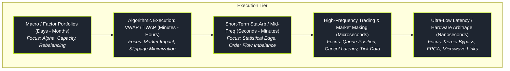

# Algorithmic and High-Frequency Trading (HFT)

> "In the latency race, speed is not merely an optimization; it is a structural boundary that changes whether you capture the spread or become adverse selection for a faster predator."

Algorithmic Trading spans automated order execution, volume-weighted slicing, and cross-venue smart order routing designed to minimize market impact for institutional portfolios. High-Frequency Trading (HFT) operates at the microsecond and nanosecond frontier, where firms act as electronic liquidity providers, arbitrage deterministic discrepancies across fragmented exchanges, and manage microsecond queue priority.

---

### Core HFT Topics

1. **[[pillars/02-algorithmic-hft/market-microstructure-and-order-types|Market Microstructure & Order Types]]**: Limit vs market orders, hidden orders, icebergs, pegged orders, and maker-taker fee structures.
2. **[[pillars/02-algorithmic-hft/low-latency-systems-architecture|Low-Latency Systems Architecture]]**: Kernel bypass networking (Solarflare Onload, DPDK), CPU isolation, NUMA affinity, and zero-allocation pipelines.
3. **[[pillars/02-algorithmic-hft/queue-position-and-fill-probability|Queue Position & Fill Probability]]**: Matching engine priority rules (FIFO vs Pro-Rata), cancellation dynamics, and adverse selection at queue heads.
4. **[[pillars/02-algorithmic-hft/execution-algorithms-vwap-twap-pov|Execution Algorithms: VWAP, TWAP, & POV]]**: Institutional order slicing, intraday volume curves, and tracking error optimization.
5. **[[pillars/02-algorithmic-hft/optimal-execution-and-almgren-chriss|Optimal Execution & Almgren-Chriss]]**: Permanent vs temporary market impact, execution risk aversion, and calculus of variations for optimal liquidation trajectories.
6. **[[pillars/02-algorithmic-hft/hardware-acceleration-and-fpga|Hardware Acceleration & FPGA]]**: Silicon tick-to-trade, wire-speed network parsing, and hardware-level trade validation.

---

### The Latency & Scale Spectrum

