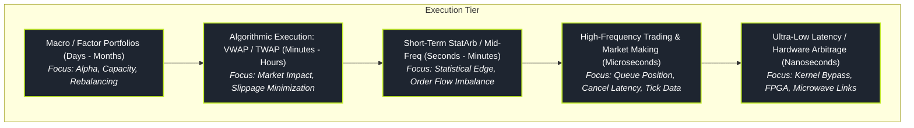

# Algorithmic and High-Frequency Trading (HFT)

> "In the latency race, speed is not merely an optimization; it is a structural boundary that changes whether you capture the spread or become adverse selection for a faster predator."

Algorithmic Trading spans automated order execution, volume-weighted slicing, and cross-venue smart order routing designed to minimize market impact for institutional portfolios. High-Frequency Trading (HFT) operates at the microsecond and nanosecond frontier, where firms act as electronic liquidity providers, arbitrage deterministic discrepancies across fragmented exchanges, and manage microsecond queue priority.

This pillar is organised into **nine topic folders** (folder-per-topic), each a self-contained hub `index.md` with six sub-pages (from-zero intuition → mathematical ground truth → implementation → failure modes → advanced extensions). Follow them in the order below — each builds on the machinery of the ones before it.

---

### Core HFT Topics

1. **[[pillars/02-algorithmic-hft/market-microstructure-and-order-types/index|Market Microstructure & Order Types]]**: The market's plumbing — limit vs market orders, hidden and iceberg orders, pegged orders, auction vs continuous trading, and maker-taker fee structures that shape every execution decision.
2. **[[pillars/02-algorithmic-hft/optimal-execution-and-almgren-chriss/index|Optimal Execution & Almgren–Chriss]]**: Permanent vs temporary market impact, execution risk aversion, and the calculus-of-variations solution for optimal liquidation trajectories.
3. **[[pillars/02-algorithmic-hft/execution-algorithms-vwap-twap-pov/index|Execution Algorithms: VWAP, TWAP, & POV]]**: Institutional order slicing, intraday volume curves, implementation shortfall, and scheduling against volume profiles to track a benchmark.
4. **[[pillars/02-algorithmic-hft/queue-position-and-fill-probability/index|Queue Position & Fill Probability]]**: Matching-engine priority rules (FIFO vs pro-rata), queue-reactive models, fill-probability estimation, and adverse selection at queue heads.
5. **[[pillars/02-algorithmic-hft/smart-order-routing-and-fragmentation/index|Smart Order Routing & Fragmentation]]**: Cross-venue fragmentation, NBBO and locked/crossed markets, SOR logic, fee-and-venue selection, and slicing a parent order across destinations.
6. **[[pillars/02-algorithmic-hft/execution-backtesting-and-simulation/index|Execution Backtesting & Simulation]]**: Transaction-cost analysis, market-impact and fill models, and realistic execution simulators that avoid the zero-fill fantasy.
7. **[[pillars/02-algorithmic-hft/colocation-and-clock-synchronization/index|Colocation & Clock Synchronization]]**: Proximity hosting, fibre vs microwave links, PTP/NTP time sync, and timestamp accuracy for latencies measured in nanoseconds.
8. **[[pillars/02-algorithmic-hft/hardware-acceleration-and-fpga/index|Hardware Acceleration & FPGA]]**: Silicon tick-to-trade, wire-speed network parsing (Solarflare/DPDK), FPGA vs CPU vs GPU, and hardware-level trade validation.
9. **[[pillars/02-algorithmic-hft/low-latency-systems-architecture/index|Low-Latency Systems Architecture]]**: Kernel-bypass networking, CPU isolation, NUMA affinity, zero-allocation pipelines, and designing end-to-end systems for microsecond response.

---

### Reading Path (Zero to HFT)

A guided route through the nine folders, in five stages.

- **Start (the machinery):** [[pillars/02-algorithmic-hft/market-microstructure-and-order-types/index|1 · Market Microstructure & Order Types]]. Learn what limits, auctions, hidden orders, and maker-taker fees actually are — everything downstream assumes these.
- **The execution core:** [[pillars/02-algorithmic-hft/optimal-execution-and-almgren-chriss/index|2 · Optimal Execution & Almgren–Chriss]] → [[pillars/02-algorithmic-hft/execution-algorithms-vwap-twap-pov/index|3 · Execution Algorithms: VWAP/TWAP/POV]]. The theory of optimal liquidation, then the benchmark-tracking heuristics institutional desks actually run.
- **Queue, fill & routing:** [[pillars/02-algorithmic-hft/queue-position-and-fill-probability/index|4 · Queue Position & Fill Probability]] → [[pillars/02-algorithmic-hft/smart-order-routing-and-fragmentation/index|5 · Smart Order Routing & Fragmentation]]. Whether a passive order fills depends on queue priority, and where it is sent depends on fragmented venue liquidity.
- **Backtesting:** [[pillars/02-algorithmic-hft/execution-backtesting-and-simulation/index|6 · Execution Backtesting & Simulation]]. Validate impact and fill assumptions before trusting any execution strategy.
- **The latency endgame:** [[pillars/02-algorithmic-hft/colocation-and-clock-synchronization/index|7 · Colocation & Clock Sync]] → [[pillars/02-algorithmic-hft/hardware-acceleration-and-fpga/index|8 · Hardware Acceleration & FPGA]] → [[pillars/02-algorithmic-hft/low-latency-systems-architecture/index|9 · Low-Latency Systems Architecture]]. Once the strategy is right, the race is measured in nanoseconds.

---

### The Latency & Scale Spectrum

---

### Original Notes

The legacy flat overview notes for these topics, retained from before the folder-per-topic reorganisation. The topic-folder hubs above supersede them as the structured study route.

- [[pillars/02-algorithmic-hft/_legacy/market-microstructure-and-order-types|Market Microstructure & Order Types (original note)]]
- [[pillars/02-algorithmic-hft/_legacy/optimal-execution-and-almgren-chriss|Optimal Execution & Almgren–Chriss (original note)]]
- [[pillars/02-algorithmic-hft/_legacy/execution-algorithms-vwap-twap-pov|Execution Algorithms: VWAP, TWAP, & POV (original note)]]
- [[pillars/02-algorithmic-hft/_legacy/queue-position-and-fill-probability|Queue Position & Fill Probability (original note)]]
- [[pillars/02-algorithmic-hft/_legacy/hardware-acceleration-and-fpga|Hardware Acceleration & FPGA (original note)]]
- [[pillars/02-algorithmic-hft/_legacy/low-latency-systems-architecture|Low-Latency Systems Architecture (original note)]]