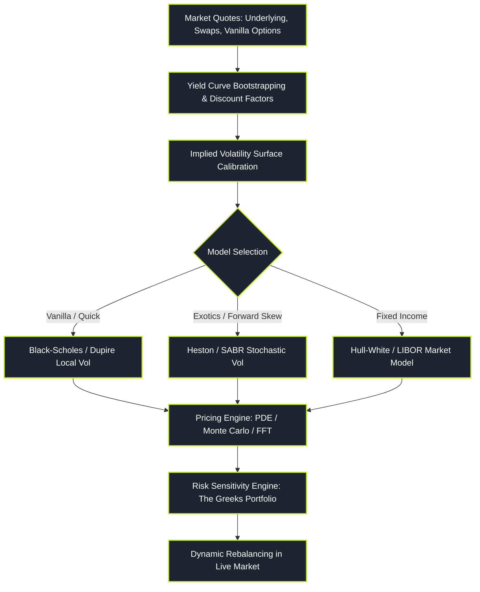

# Derivative Pricing and Structuring

> "In derivative pricing, we do not forecast where the market will go. We calculate the unique mathematical price that prevents risk-free arbitrage under continuous dynamic replication."

Derivative Pricing represents the classical sell-side quantitative domain, founded upon stochastic calculus, partial differential equations, and martingale measure theory. Its primary mandate is valuing complex non-linear financial contracts (options, swaps, structured exotics) and engineering self-financing dynamic hedges that insulate trading desks from market risk.

---

### Core Pricing & Structuring Topics

1. **[[pillars/03-derivative-pricing/no-arbitrage-and-binomial-trees|No-Arbitrage Foundations & Binomial Trees]]**: Law of one price, put-call parity, discrete dynamic replication, Cox-Ross-Rubinstein (CRR) trees, and American early-exercise frontiers.
2. **[[pillars/03-derivative-pricing/black-scholes-merton-and-feynman-kac|Black-Scholes-Merton & Feynman-Kac Bridge]]**: Delta-neutral hedging, PDE derivation, parabolic boundary conditions, and risk-neutral conditional expectations.
3. **[[pillars/03-derivative-pricing/the-greeks-and-dynamic-hedging|The Greeks & Dynamic Hedging]]**: First and higher-order Greeks (Delta, Gamma, Vega, Theta, Vanna, Volga), discrete hedging error, and the fundamental Gamma-Theta trade-off.
4. **[[pillars/03-derivative-pricing/implied-volatility-surface-and-smiles|Implied Volatility Surfaces & Smiles]]**: Numerical root finding, skew/smile dynamics, sticky-strike vs sticky-delta rules, and Dupire local volatility.
5. **[[pillars/03-derivative-pricing/advanced-volatility-heston-and-sabr|Advanced Volatility: Heston & SABR Models]]**: Stochastic variance processes, the Feller condition, characteristic functions, and swaption smile fitting.
6. **[[pillars/03-derivative-pricing/interest-rate-and-term-structure-models|Interest Rate & Term Structure Models]]**: Yield curve bootstrapping, short-rate dynamics (Vasicek, CIR), and the Hull-White no-arbitrage framework.

---

### The Derivative Engineering Pipeline

