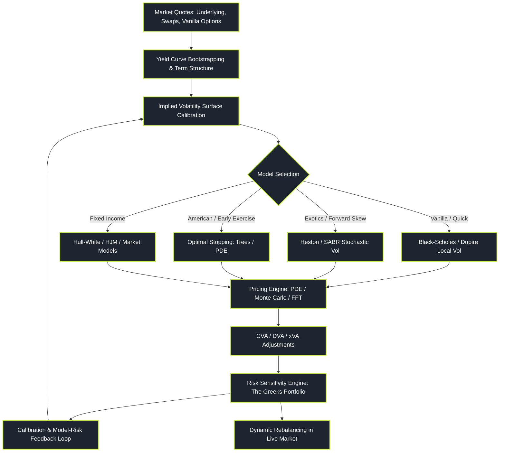

# Derivative Pricing and Structuring

> "In derivative pricing, we do not forecast where the market will go. We calculate the unique mathematical price that prevents risk-free arbitrage under continuous dynamic replication."

Derivative Pricing represents the classical sell-side quantitative domain, founded upon stochastic calculus, partial differential equations, and martingale measure theory. Its primary mandate is valuing complex non-linear financial contracts (options, swaps, structured exotics) and engineering self-financing dynamic hedges that insulate trading desks from market risk.

This pillar is organised into **eleven topic folders**, each a self-contained hub with six sub-pages. Follow them in the order below — each assumes the vocabulary of the ones before it.

---

### Core Pricing & Structuring Topics

1. **[[pillars/03-derivative-pricing/options-fundamentals-and-markets/index|Options, Futures & Markets]]**: The pillar's entry point — option contracts, payoff diagrams, put-call parity, moneyness, and how vanilla derivatives trade. No prerequisites; start here if you have never priced a derivative.
2. **[[pillars/03-derivative-pricing/no-arbitrage-and-binomial/index|No-Arbitrage & the Binomial Model]]**: Law of one price, discrete dynamic replication, risk-neutral measure, and Cox-Ross-Rubinstein (CRR) trees.
3. **[[pillars/03-derivative-pricing/black-scholes-merton/index|Black-Scholes-Merton]]**: Delta-neutral hedging, the PDE, Feynman-Kac conditional expectations, and the closed-form European pricing formula.
4. **[[pillars/03-derivative-pricing/volatility-surfaces-and-smiles/index|Volatility Surfaces & Smiles]]**: Implied-volatility root finding, skew/smile dynamics, sticky-strike vs sticky-delta rules, and Dupire local volatility.
5. **[[pillars/03-derivative-pricing/advanced-volatility-heston-sabr/index|Advanced Volatility — Heston, SABR & Stochastic-Vol Dynamics]]**: Stochastic-variance processes, the Feller condition, characteristic functions, and smile fitting for exotics.
6. **[[pillars/03-derivative-pricing/american-options-and-optimal-stopping/index|American Options & Optimal Stopping]]**: Early-exercise frontiers, free-boundary problems, dynamic programming, and tree / PDE / Monte Carlo valuation of American claims.
7. **[[pillars/03-derivative-pricing/exotic-and-path-dependent-options/index|Exotic & Path-Dependent Options]]**: Barriers, Asians, lookbacks, and structured exotics — valuation under the full toolkit of analytic, PDE, and simulation methods.
8. **[[pillars/03-derivative-pricing/numerical-methods/index|Numerical Methods]]**: Finite-difference schemes, Monte Carlo simulation, and the FFT — the computational engines that price models without closed forms.
9. **[[pillars/03-derivative-pricing/interest-rate-and-term-structure/index|Interest Rate & Term Structure]]**: Yield-curve bootstrapping, short-rate dynamics (Vasicek, CIR, Hull-White), and HJM / market models.
10. **[[pillars/03-derivative-pricing/counterparty-risk-and-xva/index|Counterparty Risk & xVA]]**: CVA/DVA/FVA, collateral, credit exposure, and how counterparty credit risk reprices a derivative.
11. **[[pillars/03-derivative-pricing/calibration-and-market-practice/index|Calibration & Market Practice]]**: Objective-function design, model selection, parameter fitting to market quotes, and model-risk governance on the desk.

---

### Reading Path (Zero to Expert)

A guided route through the eleven folders, in three stages.

- **Start (foundations):** [[pillars/03-derivative-pricing/options-fundamentals-and-markets/index|Options, Futures & Markets]] → [[pillars/03-derivative-pricing/no-arbitrage-and-binomial/index|No-Arbitrage & the Binomial Model]] → [[pillars/03-derivative-pricing/black-scholes-merton/index|Black-Scholes-Merton]]. This builds the vocabulary and the no-arbitrage/replication core that everything else extends.
- **Intermediate (volatility & exotics):** [[pillars/03-derivative-pricing/volatility-surfaces-and-smiles/index|Volatility Surfaces & Smiles]] → [[pillars/03-derivative-pricing/advanced-volatility-heston-sabr/index|Heston / SABR]] → [[pillars/03-derivative-pricing/american-options-and-optimal-stopping/index|American Options & Optimal Stopping]] → [[pillars/03-derivative-pricing/exotic-and-path-dependent-options/index|Exotic & Path-Dependent Options]] → [[pillars/03-derivative-pricing/numerical-methods/index|Numerical Methods]]. Here you move from single-model pricing to smiles, early exercise, path dependence, and the numerics that make them computable.
- **Expert (institutional pricing):** [[pillars/03-derivative-pricing/interest-rate-and-term-structure/index|Interest Rate & Term Structure]] → [[pillars/03-derivative-pricing/counterparty-risk-and-xva/index|Counterparty Risk & xVA]] → [[pillars/03-derivative-pricing/calibration-and-market-practice/index|Calibration & Market Practice]]. These cover rates desks, credit-adjusted pricing, and the live calibration discipline of a production trading floor.

---

### The Derivative Engineering Pipeline

