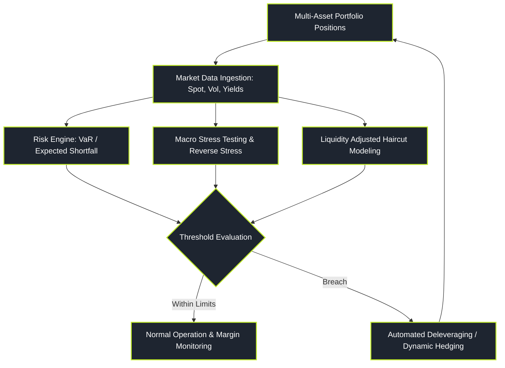

# Quantitative Risk Management

> "Risk management is not about predicting when the storm will arrive; it is about engineering a balance sheet that survives when the 100-year storm hits on three consecutive days."

Quantitative Risk Management is the science of measuring, bounding, and mitigating financial exposure across market, credit, liquidity, and operational domains. Far from a passive compliance exercise, risk modeling provides the boundary conditions that dictate how much leverage a fund can deploy, whether a trading desk can survive a liquidity spiral, and how to allocate risk budgets across competing alpha strategies.

---

### Core Risk Topics

1. **[[pillars/04-quantitative-risk/var-and-expected-shortfall|Value at Risk & Expected Shortfall (CVaR)]]**: Coherent risk measure axioms, the subadditivity flaw of VaR, and Cornish-Fisher non-normal expansions.
2. **[[pillars/04-quantitative-risk/parametric-historical-and-monte-carlo-var|Parametric, Historical, & Monte Carlo VaR]]**: Variance-covariance methods, filtered historical simulation (FHS), full-revaluation Monte Carlo, and Kupiec backtest batteries.
3. **[[pillars/04-quantitative-risk/extreme-value-theory-and-fat-tails|Extreme Value Theory & Fat Tails]]**: Breakdown of normality, Peaks-Over-Threshold (POT), Generalized Pareto Distributions (GPD), and the Hill tail index.
4. **[[pillars/04-quantitative-risk/stress-testing-and-scenario-analysis|Stress Testing & Reverse Stress Testing]]**: Historical crisis replay (1987, 1998, 2008, 2020), macroeconomic factor shocks, and capital exhaustion scenarios.
5. **[[pillars/04-quantitative-risk/credit-risk-and-the-merton-model|Credit Risk & the Merton Structural Model]]**: Equity as a call option on firm assets, distance-to-default, credit default swaps (CDS), and reduced-form default intensity.
6. **[[pillars/04-quantitative-risk/liquidity-risk-and-margin-spirals|Liquidity Risk & Margin Spirals]]**: Bid-ask spread hair-cuts, market depth exhaustion, and the Brunnermeier-Pedersen funding liquidity spiral.

---

### The Risk Management Control Loop

