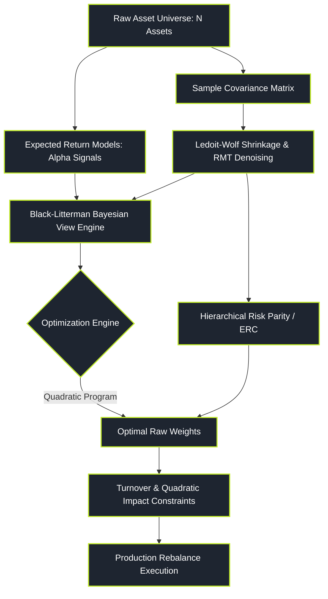

# Portfolio Construction and Optimization

> "Portfolio optimization is not about finding the mathematical maximum on historical data; it is about constructing a resilient allocation that does not blow up when the future covariance matrix diverges from the past."

Portfolio Construction and Optimization is the discipline of allocating scarce financial capital across hundreds or thousands of securities to maximize risk-adjusted return subject to explicit leverage, turnover, liquidity, and factor constraints.

While Harry Markowitz pioneered Mean-Variance Optimization in 1952, raw optimizers act as "estimation error maximizers"—placing extreme, leveraged bets on assets with the highest estimation errors in their sample returns. Modern quantitative asset allocation uses robust Bayesian priors, Random Matrix Theory denoising, Risk Parity, and Hierarchical Clustering to build stable, deployable allocations.

---

### Core Portfolio Topics

1. **[[pillars/05-portfolio-optimization/modern-portfolio-theory-and-mean-variance|Modern Portfolio Theory & Mean-Variance Frontiers]]**: The Markowitz quadratic program, the tangency portfolio, two-fund separation, and extreme input sensitivity.
2. **[[pillars/05-portfolio-optimization/covariance-shrinkage-and-denoising|Covariance Shrinkage & RMT Denoising]]**: The curse of dimensionality ($N > T$), Ledoit-Wolf analytical shrinkage, and Marchenko-Pastur random matrix filtering.
3. **[[pillars/05-portfolio-optimization/black-litterman-asset-allocation|Black-Litterman Bayesian Asset Allocation]]**: Reverse optimization for equilibrium implied returns, blending quant views with market priors, and master allocation formulas.
4. **[[pillars/05-portfolio-optimization/risk-parity-and-equal-risk-contribution|Risk Parity & Equal Risk Contribution (ERC)]]**: Marginal risk contribution, why 60/40 is secretly 90/10 equity risk, and leverage in risk-balanced portfolios.
5. **[[pillars/05-portfolio-optimization/hierarchical-risk-parity-and-clustering|Hierarchical Risk Parity (HRP)]]**: Correlation distance metrics, tree graph clustering, quasi-diagonalization, and matrix-inversion-free allocation.
6. **[[pillars/05-portfolio-optimization/transaction-costs-and-turnover-constraints|Transaction Costs & Turnover Constraints]]**: Penalizing quadratic market impact, L1/L2 regularization, and sparse rebalancing frontiers.

---

### The Modern Quantitative Allocation Workflow

