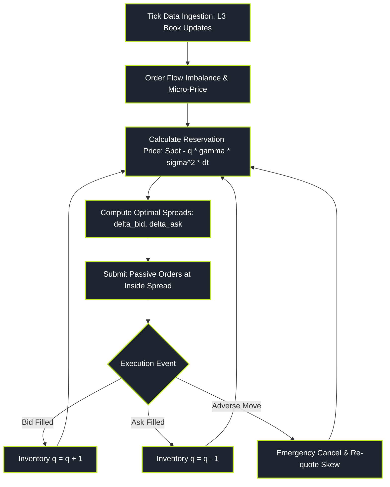

# Market Making and Liquidity Provision

> "A market maker does not bet on direction; a market maker sells umbrellas in the rain and sunscreen in the sun, charging a toll on every transaction while desperately managing inventory before the hurricane hits."

Market Making and Liquidity Provision is the operational foundation of modern electronic exchanges. Market makers quote simultaneous two-sided prices—bids to buy and asks to sell—earning the fractional bid-ask spread on every matched trade.

However, market making is a game of severe asymmetric information. A market maker faces two mortal risks:
1. **Inventory Risk:** Accumulating an unwanted directional position that moves against them.
2. **Adverse Selection:** Trading against an informed counterparty who knows the price is about to tick up or down before the market maker can cancel their quote.

---

### Core Market Making Topics

1. **[[pillars/06-market-making/limit-order-book-mechanics-and-l3|Limit Order Book Mechanics & L3 Data]]**: Level 1/2/3 data feeds, order reconstruction engines, and Order Flow Imbalance (OFI).
2. **[[pillars/06-market-making/the-avellaneda-stoikov-model|The Avellaneda-Stoikov Model]]**: Hamilton-Jacobi-Bellman (HJB) formulation, reservation prices, inventory penalty, and optimal bid-ask quotes.
3. **[[pillars/06-market-making/adverse-selection-and-glosten-milgrom|Adverse Selection & Glosten-Milgrom]]**: Informed vs uninformed noise traders, Bayesian price updating, and Kyle's Lambda price impact.
4. **[[pillars/06-market-making/spread-decomposition-and-roll-model|Spread Decomposition & the Roll Model]]**: Return autocovariance, bid-ask bounce, and separating inventory costs from adverse selection.
5. **[[pillars/06-market-making/inventory-management-and-quote-skewing|Inventory Management & Quote Skewing]]**: Asymmetric quote positioning, mean-reverting inventory targets, and overnight risk.
6. **[[pillars/06-market-making/toxic-order-flow-and-vpin|Toxic Order Flow & VPIN]]**: The Lee-Ready algorithm, Volume-Synchronized Probability of Toxicity (VPIN), and flash crash early warning metrics.

---

### The Market Making State Machine

