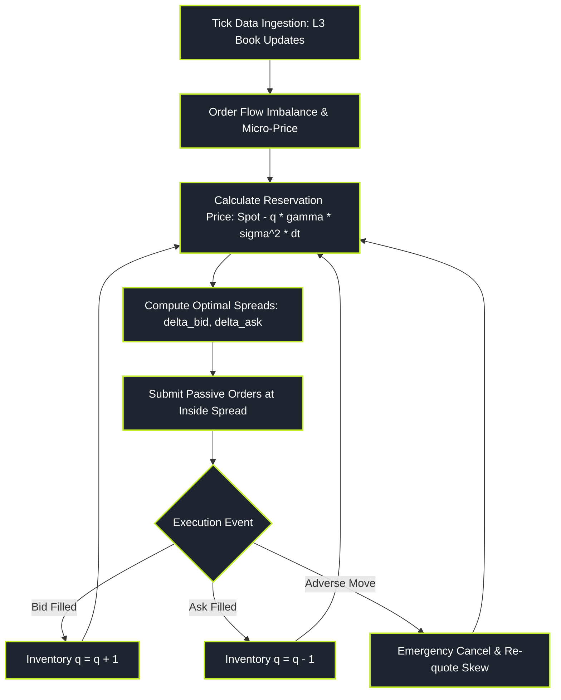

# Market Making and Liquidity Provision

> "A market maker does not bet on direction; a market maker sells umbrellas in the rain and sunscreen in the sun, charging a toll on every transaction while desperately managing inventory before the hurricane hits."

Market Making and Liquidity Provision is the operational foundation of modern electronic exchanges. Market makers quote simultaneous two-sided prices—bids to buy and asks to sell—earning the fractional bid-ask spread on every matched trade.

However, market making is a game of severe asymmetric information. A market maker faces two mortal risks:
1. **Inventory Risk:** Accumulating an unwanted directional position that moves against them.
2. **Adverse Selection:** Trading against an informed counterparty who knows the price is about to tick up or down before the market maker can cancel their quote.

---

### Core Market Making Topics

This pillar is organised into **ten topic folders** (folder-per-topic), each a self-contained hub `index.md` plus six sub-pages walking from intuition to working formulas and code. Follow them in the order below.

1. **[[pillars/06-market-making/limit-order-book-mechanics/index|Limit Order Book Mechanics]]**: The book as the state of the market — limit vs market orders, L2/L3 data, matching engine (price-time priority), queue position, and order flow imbalance.
2. **[[pillars/06-market-making/avellaneda-stoikov-and-optimal-quoting/index|Avellaneda–Stoikov & Optimal Quoting]]**: Stochastic control of the two-sided quote — the market-maker's problem, the HJB solution, reservation price, inventory penalty, and optimal spread.
3. **[[pillars/06-market-making/inventory-management-and-quote-skewing/index|Inventory Management & Quote Skewing]]**: The Ho–Stoll dealer model, the inventory risk function, mean-reverting targets, and asymmetric quote skewing.
4. **[[pillars/06-market-making/adverse-selection-and-glosten-milgrom/index|Adverse Selection & Glosten–Milgrom]]**: Informed vs noise traders, Bayesian price updating, the sequential-trade model, and spread decomposition.
5. **[[pillars/06-market-making/spread-decomposition-and-roll-model/index|Spread Decomposition & the Roll Model]]**: Quoted/effective/realized spreads, return autocovariance, bid-ask bounce, and separating inventory costs from adverse selection.
6. **[[pillars/06-market-making/toxic-order-flow-and-vpin/index|Toxic Order Flow & VPIN]]**: PIN/EKOP, the Lee–Ready algorithm, Volume-Synchronized Probability of Toxicity (VPIN), and flash-crash early warnings.
7. **[[pillars/06-market-making/market-impact-and-depth/index|Market Impact & Depth]]**: The Kyle model and Kyle's lambda, depth as 1/lambda, temporary vs permanent impact, and the square-root law.
8. **[[pillars/06-market-making/liquidity-risk-and-asset-pricing/index|Liquidity Risk & Asset Pricing]]**: Illiquidity measures (Amihud ILLIQ), liquidity as a priced factor (Pastor–Stambaugh), liquidity risk (Acharya–Pedersen), and crises.
9. **[[pillars/06-market-making/market-maker-economics-and-rebates/index|Market-Maker Economics & Rebates]]**: Market-maker P&L decomposition, maker-taker fees and rebates, competition and the race to zero, and payment for order flow.
10. **[[pillars/06-market-making/dealer-banks-and-otc/index|Dealer Banks & OTC Markets]]**: Why OTC markets exist, the Duffie–Garleanu–Pedersen search-and-bargaining model, dealer balance-sheet capacity, and central clearing.

---

### Reading Path (Zero to Market Maker)

- **Start (the machinery):** [[pillars/06-market-making/limit-order-book-mechanics/index|1 · Limit Order Book Mechanics]] → [[pillars/06-market-making/adverse-selection-and-glosten-milgrom/index|4 · Adverse Selection & Glosten–Milgrom]]. You learn what the book is and why a spread exists at all (adverse selection).
- **The quoting models:** [[pillars/06-market-making/avellaneda-stoikov-and-optimal-quoting/index|2 · Avellaneda–Stoikov]] → [[pillars/06-market-making/inventory-management-and-quote-skewing/index|3 · Inventory & Quote Skewing]]. The two workhorses for how to quote and how to manage the inventory the quotes create.
- **Diagnostics:** [[pillars/06-market-making/spread-decomposition-and-roll-model/index|5 · Spread Decomposition & Roll]] → [[pillars/06-market-making/toxic-order-flow-and-vpin/index|6 · Toxic Flow & VPIN]]. How to measure the components of the spread and detect when you are being picked off.
- **Impact & economics:** [[pillars/06-market-making/market-impact-and-depth/index|7 · Market Impact & Depth]] → [[pillars/06-market-making/liquidity-risk-and-asset-pricing/index|8 · Liquidity Risk & Asset Pricing]] → [[pillars/06-market-making/market-maker-economics-and-rebates/index|9 · MM Economics & Rebates]]. The price-impact view, why liquidity is a priced risk, and whether the business actually makes money after fees.

---

### The Market Making State Machine

---

### Original Notes

The legacy flat overview notes for these topics, retained from before the folder-per-topic reorganisation. The topic-folder hubs above supersede them as the structured study route.

- [[pillars/06-market-making/_legacy/limit-order-book-mechanics-and-l3|Limit Order Book Mechanics & L3 (original note)]]
- [[pillars/06-market-making/_legacy/the-avellaneda-stoikov-model|The Avellaneda–Stoikov Model (original note)]]
- [[pillars/06-market-making/_legacy/adverse-selection-and-glosten-milgrom|Adverse Selection & Glosten–Milgrom (original note)]]
- [[pillars/06-market-making/_legacy/spread-decomposition-and-roll-model|Spread Decomposition & the Roll Model (original note)]]
- [[pillars/06-market-making/_legacy/inventory-management-and-quote-skewing|Inventory Management & Quote Skewing (original note)]]
- [[pillars/06-market-making/_legacy/toxic-order-flow-and-vpin|Toxic Order Flow & VPIN (original note)]]
