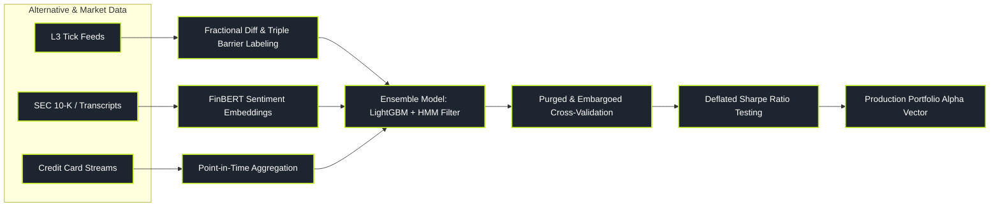

# Machine Learning and Alternative Data

> "Finance is not computer vision or natural language processing. In finance, the Signal-to-Noise ratio is minuscule, the underlying data-generating process is non-stationary, and the system actively adapts to exploit and destroy your model the moment you deploy it."

Machine Learning (ML) in quantitative finance is fundamentally different from standard Big Tech machine learning. Kaggle-style models that achieve 99% accuracy almost universally collapse to zero in live markets because they overfit to non-stationary historical noise and suffer from subtle data leakage.

Modern quantitative ML focuses on extracting weak, non-linear interactions across thousands of features, synthesizing unstructured alternative datasets (satellite imagery, credit card streams, earnings transcripts), and classifying hidden macroeconomic regimes using robust, purged validation techniques.

This pillar is organised into **nine topic folders**, each a self-contained hub `index.md` with six sub-pages (from-zero intuition → mathematical ground truth → implementation → failure modes → advanced extensions). Follow them in the order below — the machine underneath every later folder is the *evaluation* machinery built in the first two.

---

### Core ML & AltData Topics

1. **[[pillars/07-machine-learning-altdata/financial-ml-pitfalls-and-low-snr/index|Financial ML Pitfalls & Low SNR]]**: Why standard ML fails in finance — the microscopic signal-to-noise ratio, non-stationarity, and the subtle data-leakage traps that quietly destroy a backtest.
2. **[[pillars/07-machine-learning-altdata/purged-cross-validation-and-backtest-hygiene/index|Purged Cross-Validation & Backtest Hygiene]]**: Why vanilla K-fold leaks overlapping labels, the purge/embargo technique, and Combinatorial Purged CV (CPCV) for honest performance estimates.
3. **[[pillars/07-machine-learning-altdata/tree-and-boosting-methods/index|Tree & Boosting Methods]]**: Decision trees, bagging & random forests, and gradient boosting (LightGBM/XGBoost) as the workhorse for tabular factor features.
4. **[[pillars/07-machine-learning-altdata/financial-nlp-and-transcripts/index|Financial NLP & Transcripts]]**: From bag-of-words and LM dictionaries through FinBERT-style sentiment to LLM extraction on earnings transcripts and SEC filings.
5. **[[pillars/07-machine-learning-altdata/alternative-data-pipelines-and-evaluation/index|Alternative Data Pipelines & Evaluation]]**: The alt-data lifecycle — credit-card streams, geolocation, web scraping — with point-in-time hygiene and alpha-decay evaluation.
6. **[[pillars/07-machine-learning-altdata/deep-learning-for-sequences/index|Deep Learning for Sequences]]**: RNNs/LSTMs, attention & transformers, and autoencoders for tick/bar series, plus the small-sample traps unique to sequence models.
7. **[[pillars/07-machine-learning-altdata/reinforcement-learning-for-trading/index|Reinforcement Learning for Trading]]**: Trading as an MDP — value-based RL, and policy-gradient / actor-critic methods, with the stability and reward-hacking pitfalls.
8. **[[pillars/07-machine-learning-altdata/regime-classification-hmm-and-gmm/index|Regime Classification: HMM & GMM]]**: Unsupervised regime detection — GMM/K-means clustering, the EM algorithm, and HMMs as probabilistic generative models of market states.
9. **[[pillars/07-machine-learning-altdata/ml-for-portfolio/index|ML for Portfolio Construction]]**: From model forecasts to positions — ensembling models, and feeding ML outputs into covariance estimation and portfolio construction.

---

### Reading Path (Nothing → Deployed Model)

> **Before this pillar (foundations):** read [[foundations/statistics-and-inference/index|Statistics & Inference]] · [[foundations/linear-algebra-and-matrices/index|Linear Algebra]] first — see the [[foundations/index|Foundations hub]] for the full consumption order.

A guided route through the nine folders, in five stages.

- **Stage 0 — The foundation (must read first):** [[pillars/07-machine-learning-altdata/financial-ml-pitfalls-and-low-snr/index|Financial ML Pitfalls & Low SNR]] → [[pillars/07-machine-learning-altdata/purged-cross-validation-and-backtest-hygiene/index|Purged Cross-Validation & Backtest Hygiene]]. Start with why every naive ML backtest is a lie — low SNR, non-stationarity, leakage — then adopt purged/embargoed validation so every later model is measured honestly.
- **Stage 1 — The workhorse:** [[pillars/07-machine-learning-altdata/tree-and-boosting-methods/index|Tree & Boosting Methods]]. Boosted trees are the practical default for tabular factor features; learn them before reaching for anything fancier.
- **Stage 2 — Unstructured signals:** [[pillars/07-machine-learning-altdata/financial-nlp-and-transcripts/index|Financial NLP & Transcripts]] → [[pillars/07-machine-learning-altdata/alternative-data-pipelines-and-evaluation/index|Alternative Data Pipelines & Evaluation]]. Text and non-price altdata are where the (weak) edge still lives, and both only pay off when run through a leak-proof, point-in-time pipeline.
- **Stage 3 — The advanced tier:** [[pillars/07-machine-learning-altdata/deep-learning-for-sequences/index|Deep Learning for Sequences]] → [[pillars/07-machine-learning-altdata/reinforcement-learning-for-trading/index|Reinforcement Learning for Trading]] → [[pillars/07-machine-learning-altdata/regime-classification-hmm-and-gmm/index|Regime Classification: HMM & GMM]]. Sequences, policies and regime structure — powerful but data-hungry and fragile; reach here only after the evaluation foundation is solid.
- **Stage 4 — Portfolio integration:** [[pillars/07-machine-learning-altdata/ml-for-portfolio/index|ML for Portfolio Construction]]. Turn model outputs into positions: ensembling, forecast-to-position mapping, and feeding ML into covariance/portfolio machinery without reintroducing estimation error.

---

### The Quantitative ML Production Pipeline

---

### Original Notes

The legacy flat overview notes for a subset of these topics, retained from before the folder-per-topic reorganisation. They remain the same subject matter written as a single page; the topic-folder hubs above supersede them as the structured study route.

- [[pillars/07-machine-learning-altdata/financial-ml-pitfalls-and-low-snr/index|Financial ML Pitfalls & Low SNR (original note)]]
- [[pillars/07-machine-learning-altdata/tree-based-factor-ranking-and-purged-cv|Tree-Based Factor Ranking & Purged CV (original note)]]
- [[pillars/07-machine-learning-altdata/financial-nlp-and-earnings-transcripts|Financial NLP & Earnings Transcripts (original note)]]
- [[pillars/07-machine-learning-altdata/alternative-data-pipelines-and-evaluation/index|Alternative Data Pipelines & Evaluation (original note)]]
- [[pillars/07-machine-learning-altdata/regime-classification-hmm-and-gmm/index|Regime Classification: HMM & GMM (original note)]]
- [[pillars/07-machine-learning-altdata/deep-learning-for-sequential-data|Deep Learning for Sequential Data (original note)]]