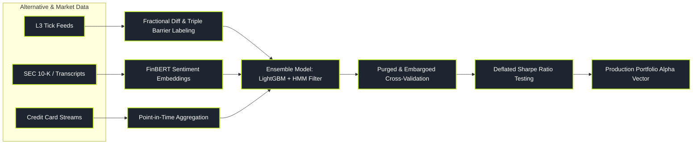

# Machine Learning and Alternative Data

> "Finance is not computer vision or natural language processing. In finance, the Signal-to-Noise ratio is minuscule, the underlying data-generating process is non-stationary, and the system actively adapts to exploit and destroy your model the moment you deploy it."

Machine Learning (ML) in quantitative finance is fundamentally different from standard Big Tech machine learning. Kaggle-style models that achieve 99% accuracy almost universally collapse to zero in live markets because they overfit to non-stationary historical noise and suffer from subtle data leakage.

Modern quantitative ML focuses on extracting weak, non-linear interactions across thousands of features, synthesizing unstructured alternative datasets (satellite imagery, credit card streams, earnings transcripts), and classifying hidden macroeconomic regimes using robust, purged validation techniques.

---

### Core ML & AltData Topics

1. **[[pillars/07-machine-learning-altdata/financial-ml-pitfalls-and-low-snr|Financial ML Pitfalls & Low SNR]]**: Why standard ML fails, the microscopic Signal-to-Noise Ratio, non-stationarity, and subtle data leakage traps.
2. **[[pillars/07-machine-learning-altdata/tree-based-factor-ranking-and-purged-cv|Tree-Based Factor Ranking & Purged CV]]**: LightGBM/XGBoost factor synthesis, Mean Decrease Accuracy (MDA), and Purged/Embargoed Cross-Validation.
3. **[[pillars/07-machine-learning-altdata/financial-nlp-and-earnings-transcripts|Financial NLP & Earnings Transcripts]]**: SEC 10-K delta analysis, FinBERT fine-tuning, earnings call Q&A sentiment, and LLM extraction.
4. **[[pillars/07-machine-learning-altdata/alternative-data-pipelines-and-evaluation|Alternative Data Pipelines & Evaluation]]**: Credit card streams, web scraping, geolocation, point-in-time hygiene, and alpha decay.
5. **[[pillars/07-machine-learning-altdata/regime-classification-hmm-and-gmm|Regime Classification: HMM & GMM]]**: Unsupervised regime detection, Baum-Welch Expectation-Maximization, and Viterbi state path decoding.
6. **[[pillars/07-machine-learning-altdata/deep-learning-for-sequential-data|Deep Learning for Sequential Data]]**: LSTMs, Temporal Convolutional Networks (TCN), and Temporal Fusion Transformers for tick and bar series.

---

### The Quantitative ML Production Pipeline

