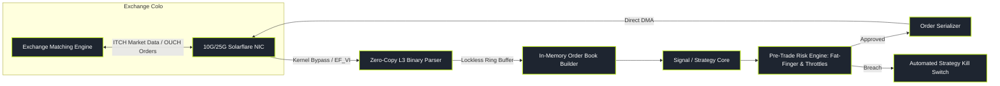

# Quantitative Development (Quant Engineering)

> "A brilliant mathematical model written by a quant researcher is merely an academic hypothesis. Quantitative Developers transform that hypothesis into production code that executes reliably in microseconds with zero memory leaks, zero race conditions, and zero tolerance for failure."

Quantitative Development is the systems and software engineering backbone of quantitative finance. Quant developers design, build, and maintain the ultra-low-latency execution engines, order routing networks, tick-level time-series databases, and event-driven backtesting infrastructure that power billions of dollars in daily algorithmic volume.

This pillar is organised into **nine topic folders** (folder-per-topic), each a self-contained hub `index.md` plus six sub-pages walking from intuition to working formulas and code. Follow them in the order below — they climb from the research/prototyping layer, through the compiled hot path and the operating system, to the data stores, the backtest engine, the wire, and finally the live production system.

---

### Core Quant Development Topics

1. **[[pillars/08-quantitative-development/python-quant-stack/index|Python Quant Stack]]**: The research-and-prototyping layer that front-ends the compiled core — NumPy vectorization, pandas pitfalls, Numba/JIT acceleration, and where the traps lie.
2. **[[pillars/08-quantitative-development/high-performance-cpp-for-trading/index|High-Performance C++ for Trading]]**: Zero-allocation paradigms, CPU cache locality (L1/L2/L3), cacheline false sharing, zero-cost abstraction, and SIMD vectorization on the tick-to-trade hot path.
3. **[[pillars/08-quantitative-development/concurrency-and-lockless-programming/index|Concurrency & Lockless Programming]]**: Why locks are slow, lock-free structures (SPSC ring buffers, the LMAX Disruptor), the C++ memory model, memory fences, and atomic synchronization.
4. **[[pillars/08-quantitative-development/low-latency-linux-and-networking/index|Low-Latency Linux & Networking]]**: Turning a stock Linux box into a deterministic execution platform — kernel tuning, kernel-bypass NICs (Solarflare/DPDK), market-data networking, and tail-latency measurement.
5. **[[pillars/08-quantitative-development/tick-level-databases-and-timeseries/index|Tick-Level Databases & Time-Series]]**: Column-oriented architectures, storage formats and compression, kdb+/q vs DuckDB/ClickHouse, and point-in-time as-of joins.
6. **[[pillars/08-quantitative-development/data-infrastructure-and-reproducibility/index|Data Infrastructure & Reproducibility]]**: Data pipelines, versioning and lineage, checksum arithmetic, and the reproducibility triangle that makes a backtest rebuildable bit-for-bit.
7. **[[pillars/08-quantitative-development/event-driven-backtesting-engines/index|Event-Driven Backtesting Engines]]**: Vectorized vs event loops, order state machines, realistic fill modeling, and deterministic historical replay.
8. **[[pillars/08-quantitative-development/fix-protocol-and-exchange-connectivity/index|FIX Protocol & Exchange Connectivity]]**: Tag-value FIX, session management and sequence recovery, order lifecycles, and binary ITCH/OUCH venue protocols.
9. **[[pillars/08-quantitative-development/production-trading-systems/index|Production Trading Systems]]**: Lifecycle and deployment, monitoring and alerting, wire-speed risk guards and kill switches, reconciliation, and surviving contact with reality.

---

### Reading Path (Zero to Production Trading System)

A guided route through the nine folders, in five stages.

- **Start (from nothing — the prototyping layer):** [[pillars/08-quantitative-development/python-quant-stack/index|1 · Python Quant Stack]]. Learn the research stack that expresses a signal in an afternoon — and the vectorization/pandas traps that quietly corrupt it. Then [[pillars/08-quantitative-development/high-performance-cpp-for-trading/index|2 · High-Performance C++ for Trading]] for what the compiled core is doing when the researcher's loop gets too slow.
- **Concurrency & the OS:** [[pillars/08-quantitative-development/concurrency-and-lockless-programming/index|3 · Concurrency & Lockless Programming]] → [[pillars/08-quantitative-development/low-latency-linux-and-networking/index|4 · Low-Latency Linux & Networking]]. How threads share data without locks, then how the kernel and NIC are tuned to deliver packets with a small tail.
- **The data layer:** [[pillars/08-quantitative-development/tick-level-databases-and-timeseries/index|5 · Tick-Level Databases & Time-Series]] → [[pillars/08-quantitative-development/data-infrastructure-and-reproducibility/index|6 · Data Infrastructure & Reproducibility]]. Where billions of ticks live and are queried without look-ahead, and the pipeline/versioning discipline that makes the result reproducible by anyone.
- **Backtesting engines:** [[pillars/08-quantitative-development/event-driven-backtesting-engines/index|7 · Event-Driven Backtesting Engines]]. Replay time honestly — signals, orders, and fills on one priority queue — before trusting any number.
- **The wire & the live system:** [[pillars/08-quantitative-development/fix-protocol-and-exchange-connectivity/index|8 · FIX Protocol & Exchange Connectivity]] → [[pillars/08-quantitative-development/production-trading-systems/index|9 · Production Trading Systems]]. How orders actually travel to the venue, and what stops the loss when the code misbehaves in production.

---

### The Production Trading Engine Architecture

---

### Original Notes

The legacy flat overview notes for these topics, retained from before the folder-per-topic reorganisation. The topic-folder hubs above supersede them as the structured study route. One cross-cutting flat note (risk guards) has no colliding folder and is retained in place, thematically superseded by the Production Trading Systems folder.

- [[pillars/08-quantitative-development/_legacy/high-performance-cpp-for-trading|High-Performance C++ for Trading (original note)]]
- [[pillars/08-quantitative-development/_legacy/tick-level-databases-and-timeseries|Tick-Level Databases & kdb+/q (original note)]]
- [[pillars/08-quantitative-development/_legacy/event-driven-backtesting-engines|Event-Driven Backtesting Engines (original note)]]
- [[pillars/08-quantitative-development/_legacy/fix-protocol-and-exchange-connectivity|FIX Protocol & Exchange Connectivity (original note)]]
- [[pillars/08-quantitative-development/_legacy/concurrency-and-lockless-programming|Concurrency & Lockless Programming (original note)]]
- [[pillars/08-quantitative-development/production-risk-guards-and-kill-switches|Production Risk Guards & Kill Switches (original note, retained in place)]]
