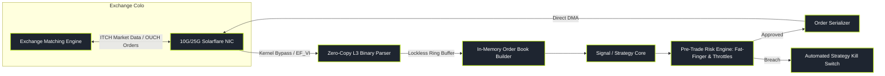

# Quantitative Development (Quant Engineering)

> "A brilliant mathematical model written by a quant researcher is merely an academic hypothesis. Quantitative Developers transform that hypothesis into production code that executes reliably in microseconds with zero memory leaks, zero race conditions, and zero tolerance for failure."

Quantitative Development is the systems and software engineering backbone of quantitative finance. Quant developers design, build, and maintain the ultra-low-latency execution engines, order routing networks, tick-level time-series databases, and event-driven backtesting infrastructure that power billions of dollars in daily algorithmic volume.

---

### Core Quant Development Topics

1. **[[pillars/08-quantitative-development/high-performance-cpp-for-trading|High-Performance C++ for Trading]]**: Zero-allocation paradigms, CPU cache locality (L1/L2/L3), cacheline false sharing, and SIMD vectorization.
2. **[[pillars/08-quantitative-development/tick-level-databases-and-timeseries|Tick-Level Databases & kdb+/q]]**: Column-oriented architectures, kdb+/q vector primitives, DuckDB/ClickHouse pipelines, and point-in-time as-of joins.
3. **[[pillars/08-quantitative-development/event-driven-backtesting-engines|Event-Driven Backtesting Engines]]**: Vectorized vs event loops, realistic fill modeling, order state machines, and deterministic historical replay.
4. **[[pillars/08-quantitative-development/fix-protocol-and-exchange-connectivity|FIX Protocol & Exchange Connectivity]]**: Tag-value FIX, session recovery, binary ITCH/OUCH protocols, and order state lifecycles.
5. **[[pillars/08-quantitative-development/concurrency-and-lockless-programming|Concurrency & Lockless Programming]]**: The LMAX Disruptor pattern, SPSC ring buffers, memory fences, and atomic synchronization.
6. **[[pillars/08-quantitative-development/production-risk-guards-and-kill-switches|Production Risk Guards & Kill Switches]]**: Wire-speed pre-trade risk checks, fat-finger caps, rate throttles, and automated kill switches.

---

### The Production Trading Engine Architecture

